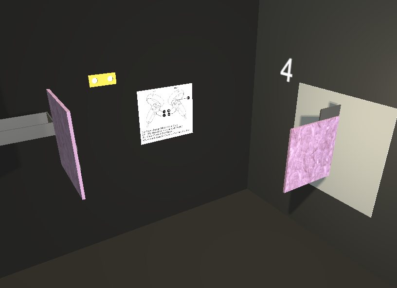
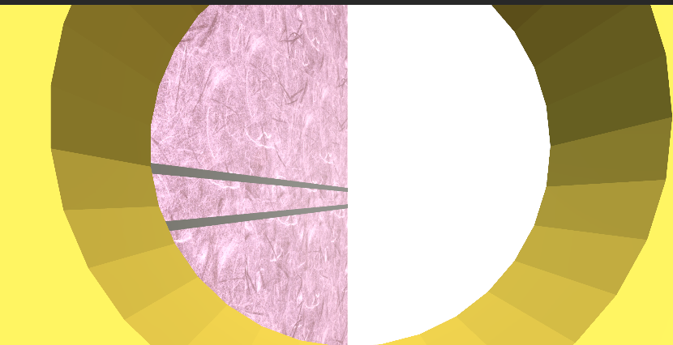

# VR Magnification Illusion Study – Unity Project

This repository contains the Unity project for a Virtual Reality environment developed as part of a follow-up study on the **magnification illusion** in VR.  
The project was conducted during an exchange program at **Shibaura Institute of Technology**, within the **Applied Perception Engineering Laboratory**.

This VR setup was developed to support and extend findings from the study:

> Sripian, P., & Yamaguchi, Y. (2024). *Magnification Illusion in Virtual Reality Environment*.  
> *Lecture Notes on Data Engineering and Communications Technologies*, 268–279. Springer Nature Switzerland.  
> [DOI: 10.1007/978-3-031-71008-7_25](https://doi.org/10.1007/978-3-031-71008-7_25)

---

### Hardware

- **VR Headset**: Oculus Quest 2 or compatible OpenXR-supported device

---

### Environment Overview

  
*Figure 1: Experimental VR scene including instruction board, "binoculars", and "answering panels"*

  
*Figure 2: Slimuli view through the binoculars (with slimuli on the side)*

---


```bibtex
@article{published_papers/48413787,
  title = {Magnification Illusion in Virtual Reality Environment},
  author = {Peeraya Sripian and Yasushi Yamaguchi},
  journal = {Lecture Notes on Data Engineering and Communications Technologies},
  month = {9},
  pages = {268--279},
  publisher = {Springer Nature Switzerland},
  doi = {10.1007/978-3-031-71008-7_25},
  year = {2024}
}
